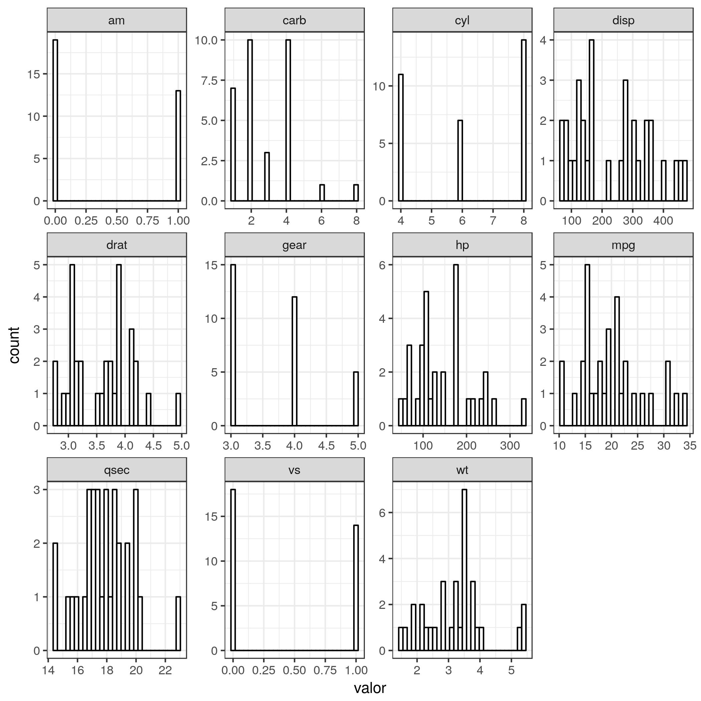

```{r setup, include=FALSE}
knitr::opts_chunk$set(echo = TRUE)
```

## Roteiro

- Introdução
- Construindo gráficos com o ggplot2
- Labels, grids e temas.
- Exercícios

## Introdução


```{r, echo=FALSE}
knitr::include_graphics('img/ggplot2.png')
```


- Criado pelo Hadley Wickham

- Gramática dos gráficos (Leland Wilkinson) -> o que é um gráfico estatístico?

- Mapeamento dos dados a partir dos atributos estéticos (posição, cores, formas, tamanhos) de formas geométricas (pontos, linhas, barras)

- Gráficos podem ser construídos em camadas.


## Por que utilizar o ggplot?


```{r, echo=FALSE, fig.cap='Gráficos no R base.'}
knitr::include_graphics('img/Etch.jpg')
```


```{r, echo=FALSE, fig.cap='Gráficos com ggplot2.'}
knitr::include_graphics('img/mrpotatohead.jpg')
```


## Vantagens em relação aos gráficos do R base

- Construção é intuitiva e organizada.
- A estrutura é a mesma para todo tipo de gráfico.
- Os gráficos já são naturalmente mais bonitos.


## Visualização (banco de dados IMDB)

Kaggle: site de desafio de análises de dados

[Link do desafio do IMDB](https://www.kaggle.com/deepmatrix/imdb-5000-movie-dataset)


## Instalar/carregar pacotes

```{r, message=FALSE}
library(ggplot2)
library(magrittr)
library(dplyr)
library(forcats)
library(readr)
library(tidyr)
```

## Ler dados

```{r}
dados <- read_rds("data/dados_imdb.rds")
dados
```

## Construindo e modificando um gráfico

1. Qual será a relação entre arrecadação e orçamento?


```{r}
# Vamos construir um gráfico de dispersão

ggplot(data = dados) +                          # Camada estrutural
  geom_point(aes(x = budget, y = gross))        # Camada dos pontos
```


Verificando valor estranho.

```{r}

dados %>% 
  filter(budget > 2e+09) %>% 
  select(movie_title, title_year, country)

```


Filtrando apenas para filmes norte-americanos.

```{r}

dados %>% 
  filter(country == "USA") %>%
  ggplot +
  geom_point(aes(x = budget, y = gross))

```


2. A relação entre arrecadação e orçamento mudou com o tempo?

```{r}
dados %>%
  filter(country == "USA") %>%
  mutate(ano_c = ifelse(title_year < 2000, "periodo1", "periodo2")) %>% 
  ggplot +
  geom_point(aes(x = budget, y = gross, color = ano_c))
```


E se usarmos o ano como variável contínua?

```{r}
dados %>%
  filter(country == "USA") %>%
  ggplot +
  geom_point(aes(x = budget, y = gross, color = title_year))
```


3. Quais filmes se pagaram?


```{r}

# Adicionamos outra camada: a reta y = x.

dados %>%
  filter(country == "USA") %>%
  ggplot +
  geom_point(aes(x = budget, y = gross, color = title_year)) +
  geom_abline(intercept = 0, slope = 1, color = "red")      # nova camada
```


A relação entre arrecadação e orçamento tem a ver com a classificação etária?


```{r}
dados %>%
  filter(country == "USA") %>%
  mutate(content_rating = content_rating %>% as.factor %>% 
           fct_collapse(Outros = c("Approved", "G", "GP", "M", "Not Rated",
                                   "Passed", "TV-14", "TV-G", "TV-MA", "TV-PG",
                                   "TV-Y7", "Unrated", "X"))) %>%
  ggplot +
  geom_point(aes(x = budget, y = gross, color = title_year, shape = content_rating)) +
  geom_abline(intercept = 0, slope = 1)

# Sem a categoria NA
dados %>%
  filter(country == "USA") %>%
  mutate(content_rating = content_rating %>% as.factor %>% 
           fct_collapse(Outros = c("Approved", "G", "GP", "M", "Not Rated",
                                   "Passed", "TV-14", "TV-G", "TV-MA", "TV-PG",
                                   "TV-Y7", "Unrated", "X"))) %>%
  select(budget, gross, title_year, content_rating) %>% 
  na.omit %>%    # retira as linhas com NAs
  ggplot +
  geom_point(aes(x = budget, y = gross, color = title_year, shape = content_rating)) +
  geom_abline(intercept = 0, slope = 1)
```


Reordenando os níveis da classificação

```{r}
dados %>%
  filter(country == "USA") %>%
  mutate(content_rating = content_rating %>% as.factor %>% 
           fct_collapse(Outros = c("Approved", "G", "GP", "M", "Not Rated",
                                   "Passed", "TV-14", "TV-G", "TV-MA", "TV-PG",
                                   "TV-Y7", "Unrated", "X")),
         content_rating = lvls_reorder(content_rating, c(3, 4, 5, 2, 1))) %>%
    select(budget, gross, title_year, content_rating) %>% 
  na.omit %>% 
  ggplot +
  geom_point(aes(x = budget, y = gross, color = title_year, shape = content_rating)) +
  geom_abline(intercept = 0, slope = 1)
```

Acrescentando labels e mudando o tema.

```{r}
dados %>%
  filter(country == "USA") %>%
  mutate(content_rating = content_rating %>% as.factor %>% 
           fct_collapse(Outros = c("Approved", "G", "GP", "M", "Not Rated",
                                   "Passed", "TV-14", "TV-G", "TV-MA", "TV-PG",
                                   "TV-Y7", "Unrated", "X")),
         content_rating = lvls_reorder(content_rating, c(3, 4, 5, 2, 1))) %>%
  
  ggplot +
  geom_point(aes(x = budget, y = gross, color = title_year, shape = content_rating)) +
  geom_abline(intercept = 0, slope = 1) +
  labs(x = "Orçamento", y = "Arrecadação", color = "Ano de\nLançamento",
       shape = "Classificação") +   # Acrescenta as labels.
  theme_bw()                        # Tema preto e branco.
```

## Exercício 1

Fazer um gráfico de dispersão da nota recebida no IMDB (imdb_score) contra o orçamento (budget) para os filmes americanos lançados depois de 2000 (inclusive).

*Passo a passo*

1. Filtrar a base para pegar os filmes americanos lançados depois de 2000.
2. Decidir qual varíavel deve ir no eixo x e qual no eixo y.
3. Usar a função `geom_point()` para construir a layer de pontos.
4. [Opcional] Deixar o gráfico mais bonito alterando as labels e o tema.

## Construindo outros tipos de gráficos

Qual a distribuição da arrecadação dos 7 diretores com mais filmes?

```{r}
dados %>%
  filter(country == "USA") %>%
  count(director_name, sort = T)

# Vamos construir um boxplot

dados %>% 
  filter(country == "USA", !is.na(director_name)) %>%
  group_by(director_name) %>% 
  filter(n() >= 15) %>% 
  ggplot +
  geom_boxplot(aes(x = as.factor(director_name), y = gross))
```

Arrumando labels do eixo x.


```{r}
dados %>% 
  filter(country == "USA", !is.na(director_name)) %>%
  group_by(director_name) %>% 
  filter(n() >= 15) %>% 
  ggplot +
  geom_boxplot(aes(x = as.factor(director_name), y = gross)) +
  theme(axis.text.x = element_text(angle=70, vjust = 0.5))
```


Ordenando pela mediana.

```{r}
dados %>% 
  filter(country == "USA", !is.na(director_name), !is.na(gross)) %>%
  group_by(director_name) %>% 
  filter(n() >= 15) %>%
  ungroup() %>% 
  mutate(director_name = director_name %>% as.factor %>%
           fct_reorder(gross, fun = median)) %>% 
  ggplot +
  geom_boxplot(aes(x = director_name, y = gross)) +
  theme(axis.text.x = element_text(angle=70, vjust = 0.5))
```

# Exercício 2

Faça um histograma das notas do imdb do Ridley Scott.
 
Passo a passo:

1. Pesquise qual `geom_` deve ser utilizado para construir histogramas.

2. Faça o histograma e reclame do quanto ficou feio.

3. Mude a cor do histograma. **Dica**: utilize os argumentos `color=` e `fill=`. Qual a diferença entre eles? Você deve utilizá-los dentro do `aes()` ou fora? 

4. Arrume o número de classes com a função `binwidth=`.


## Painéis de gráficos 

4. Compare as notas do IMDB do Tarantino, Scorsese e Tim Burton ao longo do tempo.

## Grid: notas do Tarantino, Scorsese e Tim Burton ao longo do tempo

```{r}
dados %>% 
  filter(director_name %in% c("Quentin Tarantino", "Martin Scorsese", "Tim Burton")) %>% 
  ggplot() +
  geom_point(aes(x = title_year, y = imdb_score)) +
  facet_wrap(~director_name)
```

## Ligando os pontos

```{r}
dados %>% 
  filter(director_name %in% c("Quentin Tarantino", "Martin Scorsese", "Tim Burton")) %>% 
  ggplot() +
  geom_point(aes(x = title_year, y = imdb_score)) +
  geom_line(aes(x = title_year, y = imdb_score)) +
  facet_wrap(~director_name)
```

Comparar notas acima e abaixo de 8.

```{r}
dados %>% 
  filter(director_name %in% c("Quentin Tarantino", "Martin Scorsese", "Tim Burton")) %>% 
  ggplot() +
  geom_point(aes(x = title_year, y = imdb_score)) +
  geom_line(aes(x = title_year, y = imdb_score)) +
  geom_hline(yintercept = 8, color = "dark blue") +
  facet_wrap(~director_name)
```

**Lição de casa**: pesquisar a função `facet_grid()`.


5. Quantos filmes "são feitos por ano"?

```{r}
dados %>%
  ggplot(aes(x = title_year)) +
  geom_bar(color = "black", fill = "light green")
```

```{r}
dados %>%
  count(title_year) %>% 
  ggplot(aes(x = title_year, y = n)) +
  geom_bar(stat = "identity", color = "black", fill = "light green")
```

## Exercício 3

Usando a base `mtcars` e a função `gather()`, escreva o código do gráfico abaixo.

```{r}

```


## Exercício 4

Quantos filmes o Nicholas Cage faz por ano?

Repita o gráfico de barras do número de filmes por ano filtrando a base apenas para filmes que o Nicholas Cage aparece.


## Exercício 5

Faça um gráfico de barras para a arrecadação dos filmes em que o Andrew Garfield aparece como ator (actor_1_name, actor_2_name ou actor_3_name).

Passo a passo:

1. Encontre o `geom_` para fazer gráficos de barra.
2. Utilize o argumento `stat = "identity"`. Ele deve ser usado dentro ou fora do `aes()`?
3. Rotacione os nomes dos filmes (eixo x) para eles não ficarem sobrepostos.
4. Faça cada barra ter uma cor diferente.
5. Coloque a legenda na parte de baixo do gráfico. **Dica**: procurar argumentos da função `theme()`.
6. Retire os nomes e as marcações do eixo x (sim, o passo 3 foi de sacanagem).
4. [Opcional/bônus] Acrescente o título "Andrew Garfield, eu te odeio!". **Dica**: utilizar a função `ggtitle()`.


## Mais exercícios

1 - Refaça o primeiro gráfico (arrecadação vs orçamento) colocando junto dos pontos uma curva alisada. Dica: geom_smooth().

2. Refazer o gráfico das notas do Tarantino, Scorsese e Tim Burton colocando as curvas no mesmo gráfico e as seprando pela cor.

3. Faça um gráfico para visualizar as 10 maiores bilheterias de 2016.

4. Faça um gráfico para visualizar as notas dos filmes do seu ator ou diretor preferido. Se você não tiver um (ou se tiver poucas entradas no banco de dados), escolha uma opção a seguir:

- Steven Spielberg.
- Zack Snyder
- Robin Williams
- Hugh jackman
- Jennifer Lawrence
- Meryl Streep


## Respostas

### Exercício 1

```{r}
dados %>% 
  dplyr::filter(country == "USA", title_year >= 2000) %>% 
  ggplot(aes(x = budget, y = imdb_score)) +
  geom_point() +
  labs(x = "Orçamento", y = "Nota IMDB")
```

### Exercício 2

```{r}
dados %>% 
  filter(country == "USA", director_name == "Ridley Scott") %>%  #
  unique() %>% 
  ggplot +
  geom_histogram(aes(x = imdb_score))
```

Arrumando o número de classes


```{r}
dados %>% 
  filter(director_name == "Ridley Scott") %>%  #
  unique() %>% 
  ggplot +
  geom_histogram(aes(x = imdb_score), binwidth = 0.5)
```

Mudando a cor

```{r}
dados %>% 
  filter(director_name == "Ridley Scott") %>%  #
  unique() %>% 
  ggplot +
  geom_histogram(aes(x = imdb_score), binwidth = 0.5, color = "white")
```

Mudando a cor - Parte II

```{r}
dados %>% 
  filter(director_name == "Ridley Scott") %>%  #
  unique() %>% 
  ggplot +
  geom_histogram(aes(x = imdb_score), binwidth = 0.5, fill = "white", color = "black")
```

## Exercíico 3

```{r}
mtcars %>% 
  gather(key = "variavel", value = "valor") %>% 
  ggplot +
  geom_histogram(aes(x = valor), color = "black", fill = "white") +
  facet_wrap(~variavel, scales = "free") +
  theme_bw()

#ggsave(filename = "histogramas_mtcars.jpg")
```

## Exercício 4

```{r}
dados %>%
  filter(actor_1_name == "Nicolas Cage" |
         actor_2_name == "Nicolas Cage" |
         actor_3_name == "Nicolas Cage",
         !is.na(title_year)) %>% 
  ggplot(aes(x = title_year)) +
  geom_bar(color = "black", fill = "light green")
```

## Exercício 5

```{r}
dados %>%
  filter(actor_1_name == "Andrew Garfield" |
         actor_2_name == "Andrew Garfield" |
         actor_3_name == "Andrew Garfield",
         !is.na(gross)) %>%
  mutate(movie_title = movie_title %>% as.factor %>%
           fct_reorder(gross, median)) %>% 
  ggplot() +
  geom_bar(aes(x = movie_title, y = gross, fill = movie_title), stat = "identity",
           color = "black") +
  theme(axis.text.x = element_blank(), legend.position="bottom",
        legend.title = element_blank()) +
  ggtitle("Andrew Garfield, eu te odeio!")
  
```