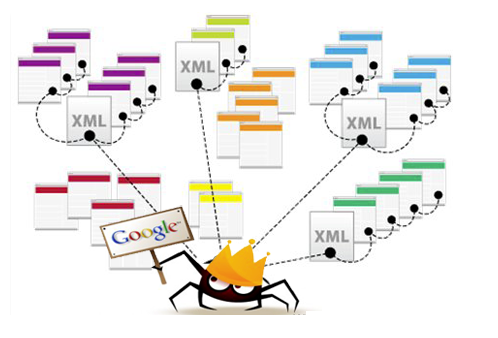

```{r include=FALSE}
knitr::opts_chunk$set(warning=FALSE, echo=FALSE, message=FALSE, out.width="90%")
```


## Sobre a Curso-R

```{r, out.width="60%"}
knitr::include_graphics("inst/foto_curso_r.jpg")
```

## Sobre a Curso-R

- Premissas:
    - Gostamos de trabalhar juntos.
    - Somos proficientes em R.
- Surgimento da empresa:
    - Motivação: contribuir com a comunidade.
    - http://curso-r.com/blog
    - http://material.curso-r.com
    - https://github.com/curso-r

## Web scraping 

"Raspagem" de dados. Diferente de web crawler.

```{r}
knitr::include_graphics("inst/ws.png")
```

## Web crawling 

```{r}

```

## Ciclo da ciência de dados

```{r, echo=FALSE}
knitr::include_graphics("inst/ds.png")
```

## web scraping

- Forma especial de `import`
- Propriedades:
    - Sistemático
    - Sem intervenção humana
- Propósitos:
    - Monitorar informações
    - Montar bases de dados

## Desafios

- Acessar um conjunto de páginas específicas
    - Pode ser **complicado**: conhecer de requisições web
- A partir de páginas HTML, extrair dados de interesse
    - Mais **simples**: ferramentas apropriadas, e.g. `rvest`

## Material

- Muito baseado em experiência própria
- Veja os scrapers
    - https://github.com/jtrecenti/chancedegol
    - https://github.com/jtrecenti/sabesp
    - https://github.com/courtsbr/esaj

## Vantagens do web scraping

- Automatização de download de bases da web
- Liberdade na obtenção de novos dados
- Análises inéditas - pré-sal sociológico

## Filosofia

- Se um humano consegue fazer, um robô consegue fazer
    - [com ressalvas](cna.oab.org.br)
- Dados públicos devem ser acessíveis
    - [exemplo: TJSC](http://esaj.tjsc.jus.br/cpopg/open.do)
- Cuidado para não onerar sistemas
- Navalha de Occam
    - Se existe API, pra quê fazer um robô?

## Requisitos

- Conceitos básicos de requisições web (GET, POST)
- Pacotes `httr`, `rvest`
- Pipe do pacote magrittr: `f(g(x)) = x %>% g() %>% f()`

## Desejável

- Tidyverse 
    - `dplyr`, `tidyr`, `stringr`, `purrr`, `lubridate`
- Expressões regulares (`regex`)
- `XPath` e `CSSPath`

